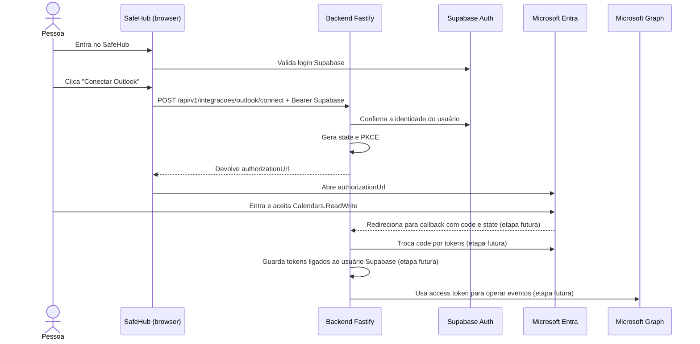

# Guia didático: conexão do Outlook no SafeHub

Este guia explica o código atual em palavras simples. A ideia é ajudar você a entender cada peça e conseguir acompanhar as próximas etapas — não é necessário decorar OAuth agora.

> **Estado atual:** o SafeHub consegue iniciar a autorização da Microsoft e devolver uma URL de login/consentimento. Ainda não recebe a volta da Microsoft, não troca o código por tokens e não grava a conexão. Portanto, a integração ainda não está completa.

## 1. O que queremos construir

Uma pessoa entra no SafeHub com sua conta Supabase e, dentro do aplicativo, escolhe **Conectar Outlook**. A Microsoft pede que ela entre e autorize o SafeHub a trabalhar com os eventos da agenda dela.

São duas autenticações diferentes:

- **Supabase:** identifica quem está usando o SafeHub.
- **Microsoft:** pergunta se essa pessoa autoriza o SafeHub a acessar a agenda Outlook dela.

A senha da Microsoft não passa pelo SafeHub. A pessoa digita a senha somente na página oficial da Microsoft.

## 2. Vocabulário essencial

| Termo              | Explicação simples                                                                                                                           |
| ------------------ | -------------------------------------------------------------------------------------------------------------------------------------------- |
| Microsoft Graph    | API oficial usada pelo backend para ler e alterar os eventos do Outlook.                                                                     |
| OAuth 2.0          | Processo pelo qual a pessoa autoriza um aplicativo sem entregar a senha a ele.                                                               |
| MSAL Node          | Biblioteca Microsoft instalada no backend (`@azure/msal-node`); ela monta pedidos de autorização e, mais tarde, trocará o código por tokens. |
| Client ID          | Identificador público do aplicativo SafeHub registrado no Microsoft Entra.                                                                   |
| Client secret      | Senha do aplicativo, usada somente pelo backend para provar sua identidade à Microsoft. Nunca deve ir para o frontend ou para o Git.         |
| Redirect URI       | Endereço do backend para onde a Microsoft retorna depois do consentimento. Precisa corresponder exatamente ao cadastrado no Entra.           |
| Scope / permissão  | O que o aplicativo pede autorização para fazer. Neste caso, `Calendars.ReadWrite`.                                                           |
| Authorization code | Código temporário que a Microsoft enviará ao callback após a autorização. O backend ainda não o processa.                                    |
| Access token       | Credencial temporária que o backend usará para chamar a Graph. Ainda não é obtido nesta etapa.                                               |
| Refresh token      | Credencial para obter novos access tokens depois. Também ainda não é obtida/guardada nesta etapa.                                            |

## 3. Caminho completo, em desenho



As partes marcadas como **etapa futura** ainda não foram implementadas.

## 4. Como usar o que existe agora

### Preparar o backend

1. Confira que `backend/.env` tem os nomes `MICROSOFT_CLIENT_ID`, `MICROSOFT_CLIENT_SECRET` e `MICROSOFT_REDIRECT_URI` com os seus valores locais. Não cole nem compartilhe o segredo.
2. A URI deve ser exatamente a mesma cadastrada na plataforma Web do aplicativo Entra: `http://localhost:3000/api/v1/integracoes/outlook/callback`.
3. O processo backend carrega `.env` ao iniciar. Se você o alterou com o servidor rodando, pare e inicie de novo com `npm run dev`.
4. Confira no Entra que existe a permissão **Microsoft Graph → Delegated → Calendars.ReadWrite**.

### Fazer o pedido de autorização

1. No Postman, selecione o ambiente **SafeHub Local**.
2. Envie o pedido **1. Login Supabase (automático)** e aguarde resposta `200`.
3. Envie **Outlook 1. Iniciar conexão (gera URL Microsoft)**. O Postman envia o token Supabase salvo pelo login.
4. A resposta esperada é `200` com JSON parecido com `{ "authorizationUrl": "https://login.microsoftonline.com/..." }`.
5. Copie `authorizationUrl` da resposta e abra no navegador. A Microsoft deverá permitir escolher a conta e mostrar o consentimento.
6. Nesta versão, depois de aceitar, o callback ainda não está implementado; então não espere que o navegador volte a uma página de sucesso do SafeHub.

Se receber `401`, a chamada do Postman não está levando um access token Supabase válido. Se receber `OUTLOOK_NOT_CONFIGURED`, confira os nomes das três variáveis exigidas no `.env` e reinicie o backend. Não coloque seus valores secretos em uma mensagem para pedir ajuda.

## 5. O que cada arquivo faz

### Configuração e segredo — `backend/src/config/microsoft.ts`

- Lê `MICROSOFT_CLIENT_ID`, `MICROSOFT_CLIENT_SECRET` e `MICROSOFT_REDIRECT_URI` do ambiente do servidor.
- Se faltar uma variável, devolve um erro de configuração em vez de tentar autenticar mal configurado.
- Cria `ConfidentialClientApplication`, a classe MSAL para aplicativos de servidor que conseguem manter o client secret privado.
- Usa a autoridade Microsoft `/common`, configurada para aceitar contas organizacionais e pessoais conforme o registro Entra.
- Cria `CryptoProvider`, ferramenta MSAL para gerar os valores PKCE.

### Endpoint — `backend/src/routes/outlookRoutes.ts`

Registra `POST /integracoes/outlook/connect`. O prefixo `/api/v1` é aplicado em `backend/src/index.ts`, então o endereço final é `POST /api/v1/integracoes/outlook/connect`.

A rota não implementa OAuth por si só: ela associa o endereço HTTP à função `startOutlookConnection` do controller.

### Proteção Supabase — `backend/src/index.ts`

A rota Outlook é registrada dentro do grupo `/api/v1`, onde o `preHandler` `requireAuthentication` roda antes dos controllers. Por isso o POST precisa do cabeçalho:

```http
Authorization: Bearer <access_token_do_supabase>
```

Esse Bearer é o token Supabase do usuário SafeHub. Não é o client secret Microsoft nem o access token Graph.

### Lógica da primeira etapa — `backend/src/controllers/outlookController.ts`

A função `startOutlookConnection` faz, nesta ordem:

1. Lê `request.user`, que o middleware Supabase preencheu após validar o Bearer.
2. Apaga do mapa as tentativas iniciadas há mais de 10 minutos.
3. Gera `verifier` e `challenge` PKCE.
4. Gera um `state` aleatório com `randomUUID()`.
5. Guarda temporariamente o ID Supabase, o verifier e a hora de criação, indexados por `state`.
6. Chama `client.getAuthCodeUrl(...)` do MSAL com a permissão `Calendars.ReadWrite`, a redirect URI, `state` e PKCE.
7. Devolve a URL ao chamador como JSON.

### O que são `state` e PKCE?

- **`state`**: identificador aleatório e imprevisível. Mais adiante, quando a Microsoft retornar com `state`, o backend procurará a tentativa correspondente. Isso ajuda a confirmar a relação entre início e retorno e usuário.
- **`verifier`**: segredo temporário gerado pelo backend.
- **`challenge`**: versão derivada do verifier que pode viajar até a Microsoft no pedido inicial. Na troca futura do código, o backend terá de apresentar o verifier original. Assim, interceptar o código sozinho não deve bastar.

Por enquanto, o mapa está no processo Node (`Map`). Reiniciar o backend apaga as tentativas; em produção, isso será substituído por armazenamento persistente/compartilhado e seguro, com expiração e consumo de uso único.

## 6. Próximas etapas, uma por vez

1. **Início (feito):** Supabase valida usuário e backend gera `authorizationUrl`.
2. **Callback:** Microsoft retorna `code` e `state`; o backend valida o `state`, recupera a tentativa e rejeita estados inválidos, expirados ou já usados.
3. **Troca de código:** MSAL usa o código, `codeVerifier`, redirect URI e credencial privada para pedir tokens Microsoft.
4. **Persistência:** associar a conexão Microsoft ao usuário Supabase e proteger os tokens (criptografia, controle de acesso, rotação/revogação); substituir o mapa temporário por storage adequado.
5. **Status e desconexão:** permitir ver se Outlook está conectado e remover/revogar a conexão.
6. **Eventos:** implementar endpoints autenticados para listar, criar, editar e excluir eventos na agenda conectada do próprio usuário.
7. **Interface:** botão de conectar, estado da conexão e telas/controles de agenda.

Não devemos passar ao CRUD de eventos antes de implementar corretamente o callback e o armazenamento de tokens, porque ainda não existe credencial Graph para fazer chamadas.

## 7. Segurança e limitações atuais

- Não enviar o `MICROSOFT_CLIENT_SECRET`, access token ou refresh token por chat, resposta Postman compartilhada, frontend ou Git.
- Não registrar tokens nem códigos nos logs.
- O callback Microsoft, tratamento de erros/consentimento, persistência segura, refresh e desconexão ainda não existem.
- O mapa local de `state` é didático e apenas para desenvolvimento com uma instância.
- A permissão é delegada: cada pessoa concede acesso à própria agenda. Não configuramos acesso de aplicativo a todos os mailboxes.

## 8. Fontes oficiais para estudar

- [MSAL Node: tutorial de aplicação web](https://learn.microsoft.com/en-us/entra/identity-platform/tutorial-v2-nodejs-webapp-msal)
- [Fluxo OAuth Authorization Code e PKCE](https://learn.microsoft.com/en-us/entra/identity-platform/v2-oauth2-auth-code-flow)
- [Permissões Microsoft Graph](https://learn.microsoft.com/en-us/graph/permissions-reference)
- [Criar eventos de calendário](https://learn.microsoft.com/en-us/graph/api/user-post-events)
