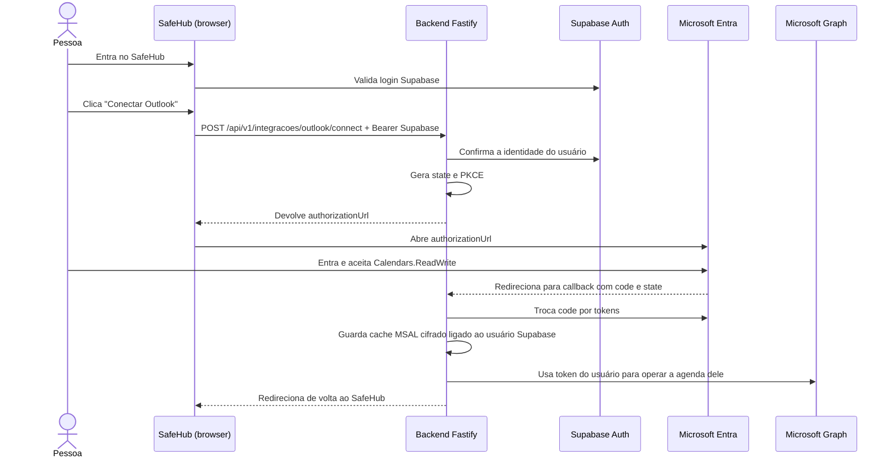

# Guia didático: conexão do Outlook no SafeHub

Este guia explica o código atual em palavras simples. A ideia é ajudar você a entender cada peça e conseguir acompanhar as próximas etapas — não é necessário decorar OAuth agora.

> **Estado atual:** o SafeHub inicia o OAuth, recebe o callback, guarda o cache MSAL cifrado por usuário e oferece operações de agenda pelo Microsoft Graph. A interface permite conectar, listar eventos dos próximos 14 dias, criar, editar, excluir e desconectar.

## 1. O que queremos construir

Uma pessoa entra no SafeHub com sua conta Supabase e, dentro do aplicativo, escolhe **Conectar Outlook**. A Microsoft pede que ela entre e autorize o SafeHub a trabalhar com os eventos da agenda dela.

São duas autenticações diferentes:

- **Supabase:** identifica quem está usando o SafeHub.
- **Microsoft:** pergunta se essa pessoa autoriza o SafeHub a acessar a agenda Outlook dela.

A senha da Microsoft não passa pelo SafeHub. A pessoa digita a senha somente na página oficial da Microsoft.

## 2. Vocabulário essencial

| Termo              | Explicação simples                                                                                                                           |
| ------------------ | -------------------------------------------------------------------------------------------------------------------------------------------- |
| Microsoft Graph    | API oficial usada pelo backend para ler e alterar os eventos do Outlook.                                                                     |
| OAuth 2.0          | Processo pelo qual a pessoa autoriza um aplicativo sem entregar a senha a ele.                                                               |
| MSAL Node          | Biblioteca Microsoft instalada no backend (`@azure/msal-node`); ela monta pedidos de autorização e troca códigos por tokens. |
| Client ID          | Identificador público do aplicativo SafeHub registrado no Microsoft Entra.                                                                   |
| Client secret      | Senha do aplicativo, usada somente pelo backend para provar sua identidade à Microsoft. Nunca deve ir para o frontend ou para o Git.         |
| Redirect URI       | Endereço do backend para onde a Microsoft retorna depois do consentimento. Precisa corresponder exatamente ao cadastrado no Entra.           |
| Scope / permissão  | O que o aplicativo pede autorização para fazer. Neste caso, `Calendars.ReadWrite`.                                                           |
| Authorization code | Código temporário que a Microsoft envia ao callback e que o backend troca por tokens.                                                        |
| Access token       | Credencial temporária que o backend usa para chamar a Graph. O MSAL gerencia a validade e renovação pelo cache.                              |
| Cache MSAL         | Dados de conta e tokens que o MSAL precisa para obter access tokens. O SafeHub guarda o cache cifrado por usuário.                            |

## 3. Caminho completo, em desenho



## 4. Como usar o que existe agora

### Preparar o backend

1. Confira que `backend/.env` tem `MICROSOFT_CLIENT_ID`, `MICROSOFT_CLIENT_SECRET`, `MICROSOFT_REDIRECT_URI`, `OUTLOOK_CACHE_ENCRYPTION_KEY` e `SAFEHUB_FRONTEND_URL`. Não cole nem compartilhe segredos.
2. A URI deve ser exatamente a mesma cadastrada na plataforma Web do aplicativo Entra: `http://localhost:3000/api/v1/integracoes/outlook/callback`.
3. O processo backend carrega `.env` ao iniciar. Se você o alterou com o servidor rodando, pare e inicie de novo com `npm run dev`.
4. Confira no Entra que existe a permissão **Microsoft Graph → Delegated → Calendars.ReadWrite**.

### Fazer o pedido de autorização

1. No Postman, selecione o ambiente **SafeHub Local**.
2. Envie o pedido **1. Login Supabase (automático)** e aguarde resposta `200`.
3. Envie **Outlook 1. Iniciar conexão (gera URL Microsoft)**. O Postman envia o token Supabase salvo pelo login.
4. A resposta esperada é `200` com JSON parecido com `{ "authorizationUrl": "https://login.microsoftonline.com/..." }`.
5. Copie `authorizationUrl` da resposta e abra no navegador. A Microsoft deverá permitir escolher a conta e mostrar o consentimento.
6. Depois de aceitar, o callback troca o código, persiste o cache MSAL cifrado e redireciona o navegador para o SafeHub.
7. Na tela autenticada, a seção Outlook permite listar os próximos 14 dias e criar, editar ou excluir eventos.

Se receber `401`, confira o access token Supabase. Se receber `OUTLOOK_NOT_CONFIGURED`, confira as variáveis Microsoft e a chave de criptografia no `.env`, e reinicie o backend. Não coloque valores secretos em mensagens ou respostas compartilhadas.

## 5. O que cada arquivo faz

### Configuração e segredo — `backend/src/config/microsoft.ts`

- Lê `MICROSOFT_CLIENT_ID`, `MICROSOFT_CLIENT_SECRET` e `MICROSOFT_REDIRECT_URI` do ambiente do servidor.
- Se faltar uma variável, devolve um erro de configuração em vez de tentar autenticar mal configurado.
- Cria `ConfidentialClientApplication`, a classe MSAL para aplicativos de servidor que conseguem manter o client secret privado.
- Usa a autoridade Microsoft `/common`, configurada para aceitar contas organizacionais e pessoais conforme o registro Entra.
- Cria `CryptoProvider`, ferramenta MSAL para gerar os valores PKCE.

### Endpoint — `backend/src/routes/outlookRoutes.ts`

Registra endpoints autenticados para iniciar/desconectar a integração, consultar seu estado e listar/criar/editar/excluir eventos. O prefixo `/api/v1` é aplicado em `backend/src/index.ts`.

A rota não implementa OAuth por si só: ela associa o endereço HTTP à função `startOutlookConnection` do controller.

### Proteção Supabase — `backend/src/index.ts`

A rota Outlook é registrada dentro do grupo `/api/v1`, onde o `preHandler` `requireAuthentication` roda antes dos controllers. Por isso o POST precisa do cabeçalho:

```http
Authorization: Bearer <access_token_do_supabase>
```

Esse Bearer é o token Supabase do usuário SafeHub. Não é o client secret Microsoft nem o access token Graph.

### Lógica da primeira etapa — `backend/src/controllers/outlookController.ts`

A função `startOutlookConnection` faz, nesta ordem:

1. Lê `request.user`, que o middleware Supabase preencheu após validar o Bearer.
2. Apaga do mapa as tentativas iniciadas há mais de 10 minutos.
3. Gera `verifier` e `challenge` PKCE.
4. Gera um `state` aleatório com `randomUUID()`.
5. Guarda temporariamente o ID Supabase, o verifier e a hora de criação, indexados por `state`.
6. Chama `client.getAuthCodeUrl(...)` do MSAL com a permissão `Calendars.ReadWrite`, a redirect URI, `state` e PKCE.
7. Devolve a URL ao chamador como JSON.

Se a conta já estiver conectada, é necessário desconectá-la antes de iniciar uma conexão diferente.

### Callback, cache e Microsoft Graph

- `backend/src/controllers/outlookCallbackController.ts` consome `state`, troca o código pelo token e redireciona ao frontend.
- `backend/src/services/outlookCachePlugin.ts` carrega e salva o cache do MSAL para o UUID Supabase daquele usuário.
- `backend/src/services/outlookTokenCrypto.ts` protege o cache com AES-256-GCM; a chave vem de `OUTLOOK_CACHE_ENCRYPTION_KEY`.
- `backend/src/services/usuarioIntegracoes.ts` lê e atualiza `public.usuario_integracoes`, usando `integracao_id = 1` para Outlook.
- `backend/src/services/outlookGraph.ts` chama `/me/calendarView` e `/me/events` com a autorização do usuário autenticado.
- A conexão individual fica em `usuario_integracoes`; a tabela `integracoes` é o catálogo de serviços.

### O que são `state` e PKCE?

- **`state`**: identificador aleatório e imprevisível. Mais adiante, quando a Microsoft retornar com `state`, o backend procurará a tentativa correspondente. Isso ajuda a confirmar a relação entre início e retorno e usuário.
- **`verifier`**: segredo temporário gerado pelo backend.
- **`challenge`**: versão derivada do verifier que pode viajar até a Microsoft no pedido inicial. Na troca futura do código, o backend terá de apresentar o verifier original. Assim, interceptar o código sozinho não deve bastar.

Por enquanto, o mapa está no processo Node (`Map`). Reiniciar o backend apaga as tentativas; em produção, isso será substituído por armazenamento persistente/compartilhado e seguro, com expiração e consumo de uso único.

## 6. O que já existe e o que falta para produção

- OAuth, cache cifrado, status, desconexão e operações de eventos estão implementados.
- O mapa de `state` ainda vive na memória do processo. Para várias instâncias ou reinícios sem interrupção do fluxo, mova as tentativas para armazenamento compartilhado com expiração e consumo único.
- A chave de criptografia precisa ser configurada separadamente em cada ambiente e ter processo de rotação antes de uso em produção.
- A tabela de conexão contém credenciais cifradas; mantenha acesso somente pelo backend e configure RLS/grants no Supabase conforme o modelo de acesso do projeto.

## 7. Segurança e limitações atuais

- Não enviar `MICROSOFT_CLIENT_SECRET`, a chave de criptografia ou cache/tokens por chat, resposta Postman compartilhada, frontend ou Git.
- Não registrar tokens nem códigos nos logs.
- O cache MSAL é cifrado no banco e separado pelo UUID Supabase do usuário.
- O mapa local de `state` funciona numa única instância em desenvolvimento; em produção, use armazenamento compartilhado.
- A permissão é delegada: cada pessoa concede acesso à própria agenda. Não configuramos acesso de aplicativo a todos os mailboxes.

## 8. Fontes oficiais para estudar

- [MSAL Node: tutorial de aplicação web](https://learn.microsoft.com/en-us/entra/identity-platform/tutorial-v2-nodejs-webapp-msal)
- [Fluxo OAuth Authorization Code e PKCE](https://learn.microsoft.com/en-us/entra/identity-platform/v2-oauth2-auth-code-flow)
- [Permissões Microsoft Graph](https://learn.microsoft.com/en-us/graph/permissions-reference)
- [Criar eventos de calendário](https://learn.microsoft.com/en-us/graph/api/user-post-events)
